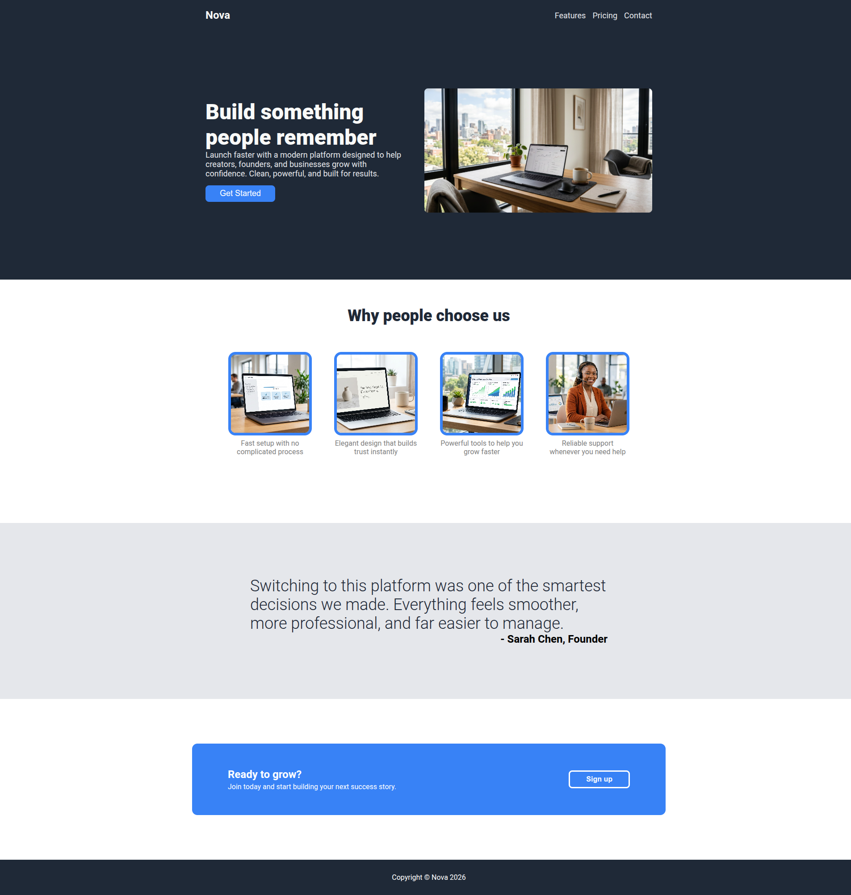

# Odin Project: Landing Page

This activity from The Odin Project had the primary goal of getting me familiar with flexbox.
Based on the reference website and styles provided, I replicated their site and added my own copy and images.
Additionally, I made the site responsive for the most part.
I am now very familiar with the basics of html and css.

## Outcome Achieved

## References

